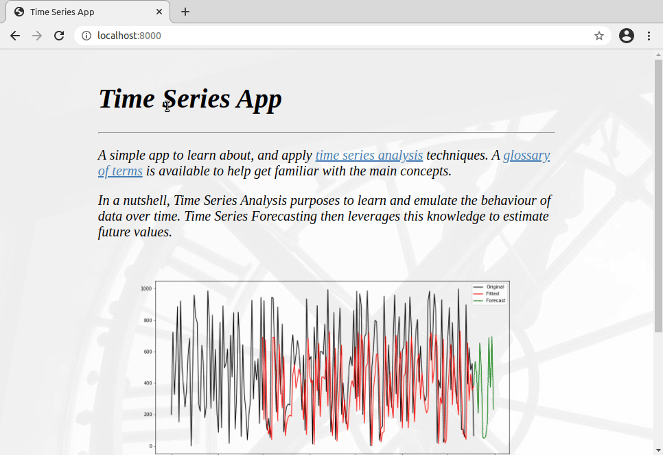

# Time Series App

A simple web app to learn a little about *[Time Series][1] analysis* and *forecasting*.


To give it a try, [click here...][2]

## Running locally

### Prerequisites

- [Python][3] 3.8 and above. Packages used include [statsmodels][4], [flask][5], [dash][8], [pandas][6] and [NumPy][7].

1. Fetching necessary files:

    ```bash
    git clone https://github.com/Tim-Abwao/time-series-app.git
    cd time-series-app
    ```

2. Setting up a virtual environment:

    ```bash
    python3 -m venv venv
    source venv/bin/activate
    pip install -U pip
    pip install -r requirements.txt
    ```

3. Starting the app:

    You can use the convenient `run.sh` script:

    ```bash
    bash run.sh
    ```

Afterwards, browse to [localhost:8000](http://127.0.0.1:8000) to interact with the web app.

[1]: https://en.wikipedia.org/wiki/Time_series
[2]: https://time-series-app.herokuapp.com
[3]: https://www.python.org "The Python programming language"
[4]: https://www.statsmodels.org/stable/index.html
[5]: https://flask.palletsprojects.com/en/1.1.x/
[6]: https://pandas.pydata.org
[7]: https://numpy.org
[8]: https://dash.plotly.com/
